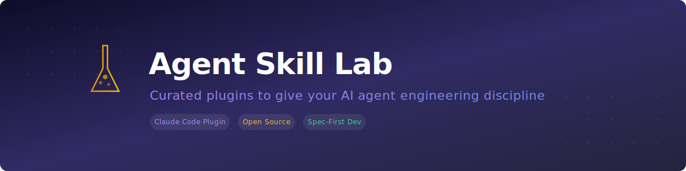

<p align="center">
  
</p>

<h3 align="center">Schluss mit Chaos — Claude-Code-Plugins, die deinem KI-Agenten Ingenieurdisziplin beibringen.</h3>

<p align="center">
  <a href="README.md">English</a> &bull;
  <a href="README_zh_TW.md">繁體中文</a> &bull;
  <a href="README_ja.md">日本語</a> &bull;
  <strong>Deutsch</strong> &bull;
  <a href="README_ko.md">한국어</a>
</p>

<p align="center">
  <a href="#installation">In 30 Sekunden installiert</a> &bull;
  <a href="#plugins">Plugins entdecken</a> &bull;
  <a href="#mitwirken">Mitwirken</a>
</p>

---

## Das Problem

KI-Coding-Agenten sind beeindruckend produktiv — solange man nicht genau hinschaut. Ohne klare Leitplanken überspringen sie Spezifikationen, vergessen Tests, hämmern fehlgeschlagene Befehle stur erneut ein und liefern APIs ohne jede Dokumentation. Das Ergebnis: Statt Features auszuliefern, spielst du Babysitter für deinen Agenten.

## Die Lösung

**Agent Skill Lab** ist ein Plugin-Marktplatz für [Claude Code](https://docs.anthropic.com/en/docs/claude-code), der Engineering-Best-Practices als installierbare Skills bereitstellt. Jedes Plugin kodifiziert eine bestimmte Disziplin — Spec-first-API-Entwicklung, saubere Befehlsausführung, strukturiertes Entwicklungsprotokoll, SQL-DDL-Konventionen — damit dein Agent dieselben Standards einhält wie ein erfahrener Entwickler.

## Installation

```bash
# 1. Marktplatz hinzufügen (einmalig)
claude plugin marketplace add https://github.com/MattAtAIEra/Agent-Skill-Lab.git

# 2. Benötigte Plugins installieren
claude plugin install dev-discipline@agent-skill-lab
claude plugin install sql-ddl-convention@agent-skill-lab
claude plugin install skill-and-agent-authoring@agent-skill-lab
```

## Plugins

| Plugin | Skills | Erzwungene Disziplin |
|--------|--------|---------------------|
| **dev-discipline** | `api-dev-workflow` `command-execution` `dev-log` | Spec-first-API-Entwicklung, sichere Befehlsausführung, strukturiertes Entwicklungsprotokoll |
| **sql-ddl-convention** | `sql-ddl-convention` | DDL-Designstandards — Audit-Felder, Indizes, Namenskonventionen, Mermaid-ERD-Generierung |
| **skill-and-agent-authoring** | `skill-and-agent-authoring` | Korrekte YAML-Frontmatter und Verzeichnisstruktur für die Plugin-Erstellung |

### dev-discipline

Drei Skills, die den Entwicklungsworkflow deines Agenten wasserdicht machen:

- **api-dev-workflow** — Erzwingt Spec-first-Entwicklung: API-Spezifikation schreiben, Bestätigung einholen, implementieren, testen, Postman-Collection & OpenAPI-Doku generieren. Kein Schritt darf übersprungen werden.
- **command-execution** — Verhindert blindes Wiederholen. Einmal ausführen → Ergebnis prüfen → Ursache analysieren → nächsten Schritt entscheiden. Deckt Arbeitsverzeichnis-Validierung, Voraussetzungsprüfung und Hintergrundprozess-Verwaltung ab.
- **dev-log** — Dokumentiert jede Entwicklungsphase automatisch in `doc/dev-log.md` mit strukturierten Einträgen: Was wurde getan, was wurde entdeckt, aktueller Teststatus.

### sql-ddl-convention

Ein umfassendes SQL-DDL-Regelwerk:

- `BIGINT`-Primärschlüssel, verpflichtende Audit-Felder (`creator`, `createDate`, `modifier`, `modifyDate`, `removed`)
- Fremdschlüssel-Benennung `<tableName>_id`, keine FK-Constraints (Verantwortung der Anwendungsschicht)
- Indexregeln, standardmäßig `NOT NULL`, `camelCase`-Benennung, keine ENUMs, kein `FLOAT` für Geldbeträge
- Automatische Mermaid-ER-Diagramm-Generierung bei jeder DDL-Ausgabe

### skill-and-agent-authoring

Das Meta-Plugin: eine Anleitung zum Erstellen neuer Skills und Agents mit korrektem YAML-Frontmatter, Trigger-Phrasen-Konventionen, Verzeichnisstruktur und Tool-Konfiguration.

## Projektstruktur

```
agent-skill-lab/
├── .claude-plugin/
│   └── marketplace.json
├── plugins/
│   ├── dev-discipline/         # API-Workflow, Befehlssicherheit, Entwicklungsprotokoll
│   ├── sql-ddl-convention/     # SQL-DDL-Standards + Mermaid-ERD
│   └── skill-and-agent-authoring/  # Plugin-Erstellungsanleitung
├── banner.svg
└── README.md
```

## Mitwirken

Du hast bewährte Entwicklungspraktiken, die auch KI-Agenten einhalten sollten? Mach ein Plugin daraus. Pull Requests sind herzlich willkommen.

1. Forke dieses Repository
2. Erstelle dein Plugin unter `plugins/your-plugin-name/`
3. Nutze das **skill-and-agent-authoring**-Plugin als Formatierungsleitfaden
4. Reiche einen PR ein

## Lizenz

MIT

---

<p align="center">
  <sub>Gebaut für Entwickler, die von ihrer KI denselben Anspruch erwarten wie von sich selbst.</sub>
</p>
