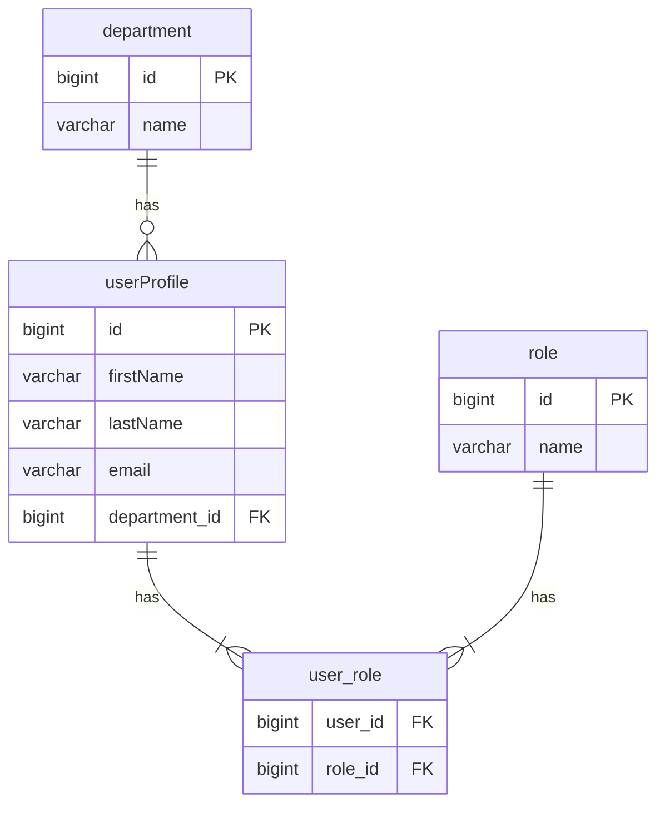

# SQL DDL Convention

When the user requests creating tables, designing schemas, writing DDL, or discussing database structure design, **the following conventions must be followed**.

---

## 1. Primary Key Rules

- All tables use `id` as the primary key column, type `BIGINT`
- Do not use natural keys as primary keys

## 2. Audit Fields (Required for Every Table)

Every regular table (excluding many-to-many join tables) must include the following columns:

| Column | Type | Constraints | Description |
|---|---|---|---|
| `creator` | BIGINT | NOT NULL | Creator user ID |
| `createDate` | DATETIME | NOT NULL, DEFAULT CURRENT_TIMESTAMP | Creation timestamp |
| `modifier` | BIGINT | NOT NULL | Last modifier user ID |
| `modifyDate` | DATETIME | NOT NULL, DEFAULT CURRENT_TIMESTAMP ON UPDATE CURRENT_TIMESTAMP | Modification timestamp (adjust syntax per RDBMS) |
| `removed` | BOOLEAN | NOT NULL, DEFAULT FALSE | Soft-delete flag |

## 3. Foreign Key Rules

- Foreign key columns are named `<tableName>_id`, type `BIGINT`
- **Do not create FK constraints** (foreign key enforcement is the application layer's responsibility)
- Foreign key columns must be indexed

## 4. Index Rules

The following columns **must** be indexed:

- `id` (comes with PK, no additional index needed)
- `creator`, `createDate`, `modifier`, `modifyDate`, `removed`
- All foreign key columns (`<tableName>_id`)

Index naming convention: `idx_<tableName>_<columnName>`

INDEX statements must be created **outside of the CREATE TABLE statement**.

## 5. No Database-Specific Features

DDL must maintain **cross-RDBMS portability**. Do not use:

- MSSQL Temporal Tables / History mechanisms
- PostgreSQL ARRAY, JSONB, or other proprietary types
- MySQL SPATIAL INDEX
- Any other database-specific types or mechanisms

Use only ANSI SQL standard or widely supported syntax.

## 6. Many-to-Many Join Table Rules

- Create a dedicated relation table to represent many-to-many relationships
- Join tables **do not need** `id`, `creator`, `createDate`, `modifier`, `modifyDate`, `removed` columns
- Include only two `<tableName>_id` columns forming a **composite primary key**
- Both columns must be indexed
- Table naming format: `<tableA>_<tableB>` (e.g., `user_role`)

## 7. NOT NULL by Default

- Columns default to `NOT NULL`
- Only allow nullable when the business logic explicitly requires NULL, with a comment explaining the reason

## 8. Naming Conventions

| Item | Rule | Example |
|---|---|---|
| Table name | Singular + camelCase | `userProfile`, `orderItem` |
| Column name | camelCase | `createDate`, `firstName` |
| Index name | `idx_<tableName>_<columnName>` | `idx_userProfile_creator` |

## 9. Monetary Columns

- Use `DECIMAL` type (must specify precision, e.g., `DECIMAL(19,4)`)
- **Do not** use FLOAT / DOUBLE for monetary values

## 10. No ENUMs

- Do not use database ENUM types
- Use application-layer constants or create a separate reference table instead

## 11. Audit Field Defaults

- `createDate`: `DEFAULT CURRENT_TIMESTAMP`
- `modifyDate`: `DEFAULT CURRENT_TIMESTAMP ON UPDATE CURRENT_TIMESTAMP`
  - If the target RDBMS does not support `ON UPDATE`, add a comment indicating the application layer must handle this

## 12. Soft-Delete Query Reminder

- When outputting DDL, include a reminder: all queries should default to `WHERE removed = FALSE`
- Unless the user explicitly needs to query deleted records

## 13. String Columns

- `VARCHAR` must specify an explicit length limit (e.g., `VARCHAR(255)`)
- Use `TEXT` type for long text content

## 14. ID Type Consistency

- All ID-type columns use `BIGINT` uniformly: primary key `id`, foreign keys `<tableName>_id`, `creator`, `modifier`

## 15. Mermaid ER Diagram Output

When outputting DDL, **a corresponding Mermaid erDiagram must also be generated** for documentation and visualization.

### Mermaid Output Rules

- Each table is rendered as an entity, listing all columns (with types and PK/FK markers)
- Audit fields (`creator`, `createDate`, `modifier`, `modifyDate`, `removed`) are **omitted** to keep diagrams clean
- Table relationships use Mermaid relationship syntax
- Many-to-many relationships are split into two one-to-many relationships via the join table

### Mermaid Relationship Syntax

| Symbol | Meaning |
|--------|---------|
| `\|\|--o{` | one-to-many |
| `\|\|--\|\|` | one-to-one |
| `\|\|--\|{` | one-to-many (mandatory) |
| `o{--o{` | many-to-many (split via join table) |

### Mermaid Column Markers

- `PK` — Primary key
- `FK` — Foreign key
- Types use shorthand: `bigint`, `varchar`, `datetime`, `boolean`, `decimal`, `text`

---

## DDL Output Template

### Regular Table Example

```sql
CREATE TABLE userProfile (
    id BIGINT NOT NULL AUTO_INCREMENT,
    firstName VARCHAR(100) NOT NULL,
    lastName VARCHAR(100) NOT NULL,
    email VARCHAR(255) NOT NULL,
    department_id BIGINT NOT NULL,
    creator BIGINT NOT NULL,
    createDate DATETIME NOT NULL DEFAULT CURRENT_TIMESTAMP,
    modifier BIGINT NOT NULL,
    modifyDate DATETIME NOT NULL DEFAULT CURRENT_TIMESTAMP ON UPDATE CURRENT_TIMESTAMP,
    removed BOOLEAN NOT NULL DEFAULT FALSE,
    PRIMARY KEY (id)
);

-- Indexes
CREATE INDEX idx_userProfile_email ON userProfile (email);
CREATE INDEX idx_userProfile_department_id ON userProfile (department_id);
CREATE INDEX idx_userProfile_creator ON userProfile (creator);
CREATE INDEX idx_userProfile_createDate ON userProfile (createDate);
CREATE INDEX idx_userProfile_modifier ON userProfile (modifier);
CREATE INDEX idx_userProfile_modifyDate ON userProfile (modifyDate);
CREATE INDEX idx_userProfile_removed ON userProfile (removed);
```

### Many-to-Many Join Table Example

```sql
CREATE TABLE user_role (
    user_id BIGINT NOT NULL,
    role_id BIGINT NOT NULL,
    PRIMARY KEY (user_id, role_id)
);

-- Indexes
CREATE INDEX idx_user_role_user_id ON user_role (user_id);
CREATE INDEX idx_user_role_role_id ON user_role (role_id);
```

### Mermaid ER Diagram Example

The following corresponds to the DDL examples above for `userProfile`, `department`, `role`, and the many-to-many join:



**Notes:**
- Audit fields (creator, createDate, modifier, modifyDate, removed) are not shown in the ER Diagram
- Many-to-many relationships are expressed through a join table (`user_role`) split into two one-to-many relationships
- Column types use shorthand (`bigint` instead of `BIGINT NOT NULL`)
- Join table columns are marked only as `FK`, not `PK` (even though they form a composite PK in practice)

---

## Verification Checklist

After generating DDL, verify each item:

- [ ] Primary key is `id BIGINT`
- [ ] All 5 audit fields included (`creator`, `createDate`, `modifier`, `modifyDate`, `removed`)
- [ ] Audit field defaults are correct
- [ ] Foreign key columns named `<tableName>_id`, no FK constraints
- [ ] All required columns are indexed (separate CREATE INDEX statements)
- [ ] Index names follow `idx_<tableName>_<columnName>` format
- [ ] Columns default to NOT NULL
- [ ] Table names are singular + camelCase
- [ ] Column names are camelCase
- [ ] No ENUMs, FLOAT/DOUBLE for money, or database-specific features
- [ ] VARCHAR has explicit length limits
- [ ] Many-to-many tables use composite PK, no audit fields
- [ ] Soft-delete query reminder included
- [ ] Corresponding Mermaid erDiagram generated
- [ ] Audit fields omitted from Mermaid diagram
- [ ] Many-to-many expressed via join table in Mermaid

> **Reminder**: All queries against these tables should default to `WHERE removed = FALSE`, unless explicitly querying deleted records.
