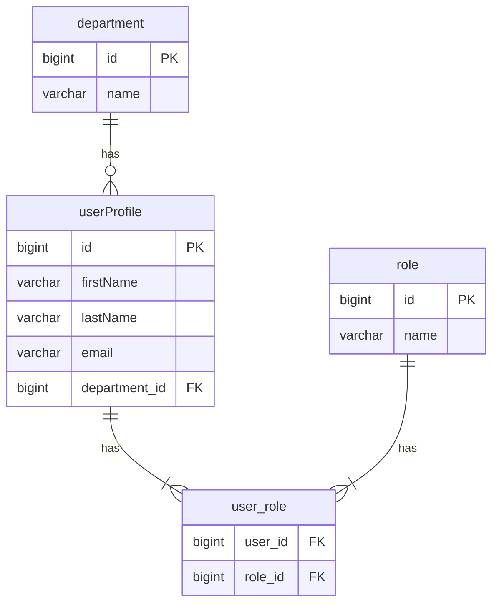

# SQL DDL Convention

當使用者要求建立資料表、設計 schema、撰寫 DDL、或討論資料庫結構設計時，**必須遵循以下規範**。

---

## 1. 主鍵規則

- 所有表的主鍵欄位名為 `id`，型別 `BIGINT`
- 不使用自然鍵作為主鍵

## 2. 審計欄位（每表必備）

每張一般表（非 many-to-many 關聯表）必須包含以下欄位：

| 欄位名 | 型別 | 約束 | 說明 |
|---|---|---|---|
| `creator` | BIGINT | NOT NULL | 建立者 ID |
| `createDate` | DATETIME | NOT NULL, DEFAULT CURRENT_TIMESTAMP | 建立時間 |
| `modifier` | BIGINT | NOT NULL | 修改者 ID |
| `modifyDate` | DATETIME | NOT NULL, DEFAULT CURRENT_TIMESTAMP ON UPDATE CURRENT_TIMESTAMP | 修改時間（依 RDBMS 語法調整） |
| `removed` | BOOLEAN | NOT NULL, DEFAULT FALSE | 軟刪除標記 |

## 3. 外鍵規則

- 外鍵欄位命名為 `<tableName>_id`，型別 `BIGINT`
- **不建立 FK constraint**（外鍵約束由應用層負責）
- 外鍵欄位必須建立索引

## 4. 索引規則

以下欄位**必須**建立索引：

- `id`（PK 自帶，無需額外建立）
- `creator`、`createDate`、`modifier`、`modifyDate`、`removed`
- 所有外鍵欄位（`<tableName>_id`）

索引命名規範：`idx_<tableName>_<columnName>`

INDEX 語句須**獨立於 CREATE TABLE 之外**建立。

## 5. 禁用資料庫特有功能

DDL 須保持**跨 RDBMS 可移植性**，禁止使用：

- MSSQL Temporal Table / History 機制
- PostgreSQL ARRAY、JSONB 等專有型別
- MySQL SPATIAL INDEX
- 其他特定資料庫獨有的型別或機制

僅使用 ANSI SQL 標準或廣泛支援的語法。

## 6. Many-to-Many 關聯表規則

- 建立獨立的 relation table 來表達多對多關係
- 關聯表**不需要** `id`、`creator`、`createDate`、`modifier`、`modifyDate`、`removed` 欄位
- 僅包含兩個 `<tableName>_id` 欄位，組成**複合主鍵（Composite PK）**
- 兩個關聯欄位皆須建立索引
- 表名格式：`<tableA>_<tableB>`（如 `user_role`）

## 7. NOT NULL 原則

- 欄位預設為 `NOT NULL`
- 僅在業務邏輯明確需要 NULL 時才允許 nullable，並以註解說明原因

## 8. 命名規範

| 項目 | 規則 | 範例 |
|---|---|---|
| 表名 | 單數 + camelCase | `userProfile`、`orderItem` |
| 欄位名 | camelCase | `createDate`、`firstName` |
| 索引名 | `idx_<tableName>_<columnName>` | `idx_userProfile_creator` |

## 9. 金額欄位

- 使用 `DECIMAL` 型別（須指定精度，如 `DECIMAL(19,4)`）
- **禁止** FLOAT / DOUBLE 儲存金額

## 10. 禁用 ENUM

- 不使用資料庫 ENUM 型別
- 改用應用層常數或建立獨立的參照表（reference table）

## 11. 審計欄位預設值

- `createDate`：`DEFAULT CURRENT_TIMESTAMP`
- `modifyDate`：`DEFAULT CURRENT_TIMESTAMP ON UPDATE CURRENT_TIMESTAMP`
  - 若目標 RDBMS 不支援 `ON UPDATE`，以註解標示需由應用層處理

## 12. 軟刪除查詢提醒

- 產出 DDL 時附帶提醒：所有查詢預設須加 `WHERE removed = FALSE`
- 除非使用者明確要查詢已刪除資料

## 13. 字串欄位

- `VARCHAR` 必須指定明確長度上限（如 `VARCHAR(255)`）
- 長文本使用 `TEXT` 型別

## 14. ID 類型一致性

- 所有 ID 類欄位統一使用 `BIGINT`：主鍵 `id`、外鍵 `<tableName>_id`、`creator`、`modifier`

## 15. Mermaid ER Diagram 產出

產出 DDL 時，**必須同時產出對應的 Mermaid erDiagram 語法**，用於文件與視覺化。

### Mermaid 產出規則

- 每張表以 entity 呈現，列出所有欄位（含型別與 PK/FK 標記）
- 審計欄位（`creator`、`createDate`、`modifier`、`modifyDate`、`removed`）**省略不列**，以保持圖表簡潔
- 表間關聯使用 Mermaid relationship 語法表達
- Many-to-Many 透過 join table 拆成兩個 one-to-many 關聯

### Mermaid Relationship 語法

| 符號 | 意義 |
|------|------|
| `\|\|--o{` | one-to-many（一對多） |
| `\|\|--\|\|` | one-to-one（一對一） |
| `\|\|--\|{` | one-to-many（一對多，必須存在） |
| `o{--o{` | many-to-many（透過 join table 拆解） |

### Mermaid 欄位標記

- `PK` — 主鍵
- `FK` — 外鍵
- 型別使用簡化名稱：`bigint`、`varchar`、`datetime`、`boolean`、`decimal`、`text`

---

## DDL 產出模板

### 一般表範例

```sql
CREATE TABLE userProfile (
    id BIGINT NOT NULL AUTO_INCREMENT,
    firstName VARCHAR(100) NOT NULL,
    lastName VARCHAR(100) NOT NULL,
    email VARCHAR(255) NOT NULL,
    department_id BIGINT NOT NULL,
    creator BIGINT NOT NULL,
    createDate DATETIME NOT NULL DEFAULT CURRENT_TIMESTAMP,
    modifier BIGINT NOT NULL,
    modifyDate DATETIME NOT NULL DEFAULT CURRENT_TIMESTAMP ON UPDATE CURRENT_TIMESTAMP,
    removed BOOLEAN NOT NULL DEFAULT FALSE,
    PRIMARY KEY (id)
);

-- Indexes
CREATE INDEX idx_userProfile_email ON userProfile (email);
CREATE INDEX idx_userProfile_department_id ON userProfile (department_id);
CREATE INDEX idx_userProfile_creator ON userProfile (creator);
CREATE INDEX idx_userProfile_createDate ON userProfile (createDate);
CREATE INDEX idx_userProfile_modifier ON userProfile (modifier);
CREATE INDEX idx_userProfile_modifyDate ON userProfile (modifyDate);
CREATE INDEX idx_userProfile_removed ON userProfile (removed);
```

### Many-to-Many 關聯表範例

```sql
CREATE TABLE user_role (
    user_id BIGINT NOT NULL,
    role_id BIGINT NOT NULL,
    PRIMARY KEY (user_id, role_id)
);

-- Indexes
CREATE INDEX idx_user_role_user_id ON user_role (user_id);
CREATE INDEX idx_user_role_role_id ON user_role (role_id);
```

### Mermaid ER Diagram 範例

以下對應上方 DDL 範例中的 `userProfile`、`department`、`role` 以及 many-to-many 關聯：



**注意事項：**
- 審計欄位（creator、createDate、modifier、modifyDate、removed）不在 ER Diagram 中呈現
- Many-to-Many 關係透過 join table（`user_role`）拆成兩個 one-to-many
- 欄位型別使用簡化名稱（`bigint` 而非 `BIGINT NOT NULL`）
- join table 的欄位僅標記 `FK`，不標記 `PK`（雖然實際是 composite PK）

---

## 驗證檢查清單

產出 DDL 後，逐項確認：

- [ ] 主鍵為 `id BIGINT`
- [ ] 包含全部 5 個審計欄位（`creator`、`createDate`、`modifier`、`modifyDate`、`removed`）
- [ ] 審計欄位預設值正確
- [ ] 外鍵欄位命名為 `<tableName>_id`，無 FK constraint
- [ ] 所有必要欄位皆建立索引（獨立 CREATE INDEX 語句）
- [ ] 索引命名符合 `idx_<tableName>_<columnName>` 格式
- [ ] 欄位預設 NOT NULL
- [ ] 表名單數 + camelCase
- [ ] 欄位名 camelCase
- [ ] 無 ENUM、FLOAT/DOUBLE 金額、資料庫專有功能
- [ ] VARCHAR 有明確長度上限
- [ ] Many-to-Many 表使用複合主鍵，無審計欄位
- [ ] 附帶軟刪除查詢提醒
- [ ] 產出對應的 Mermaid erDiagram
- [ ] Mermaid 中省略審計欄位
- [ ] Mermaid 中 Many-to-Many 透過 join table 表達

> **提醒**: 所有對此表的查詢預設應包含 `WHERE removed = FALSE`，除非明確需要查詢已刪除資料。
